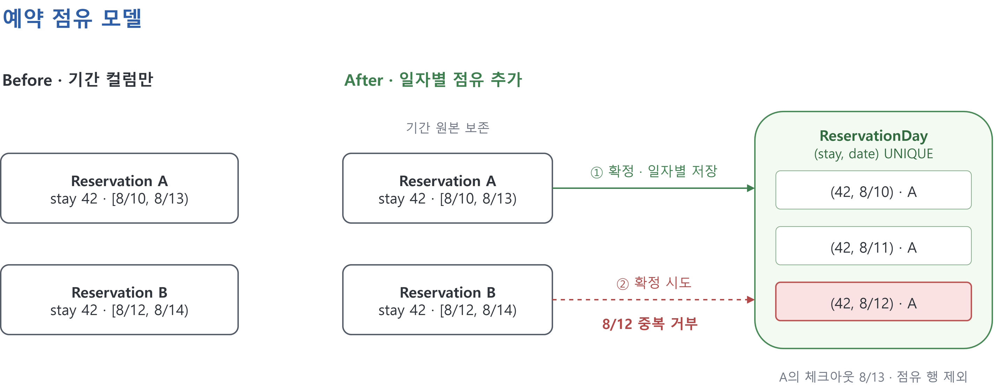
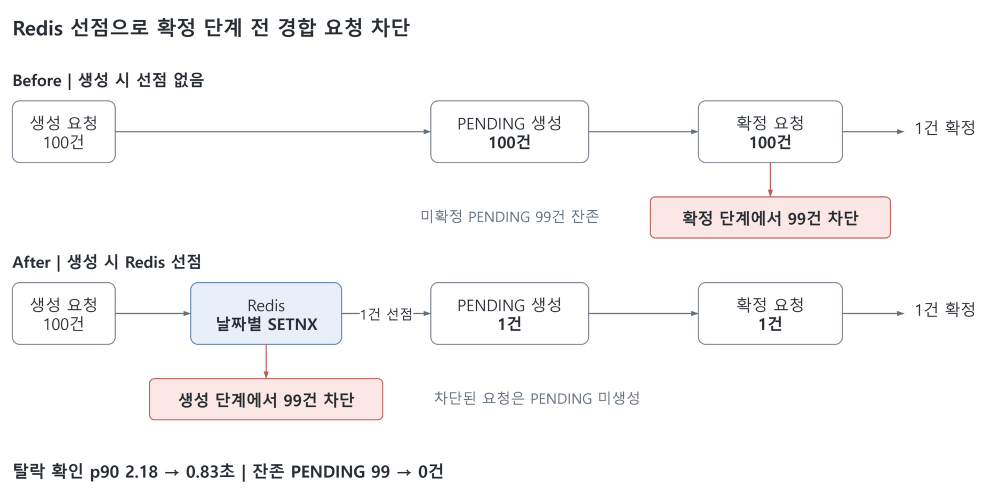
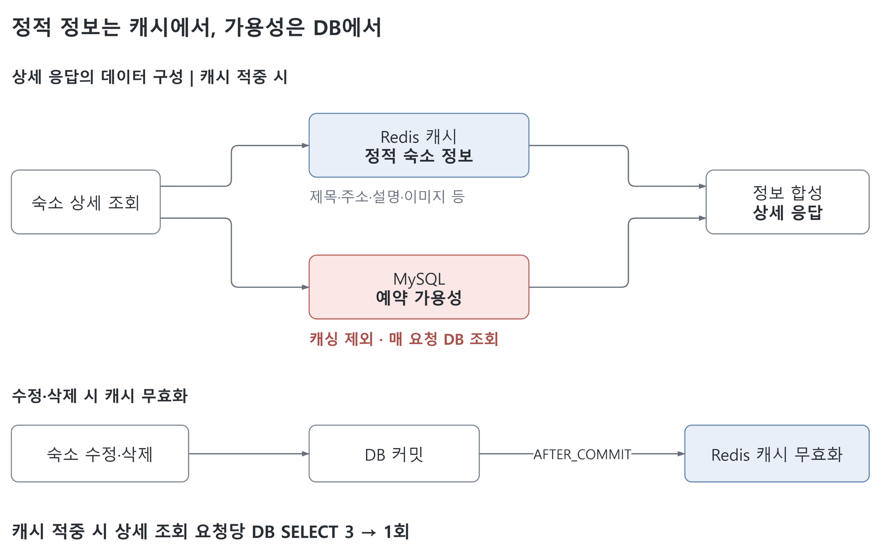

# SIDO · 시도

**시골 시니어와 도시 시니어를 연결하는 하숙 체험 서비스**

- **시도:** '시'골 시니어와 '도'시 시니어를 연결한다는 의미
- **사랑방:** 서비스 내 하숙형 숙소를 지칭하는 이름
- **기획 의도:** 귀촌 전 하숙 체험으로 지역 주민과 교류하고 정착 부담을 줄이는 기회 제공
- **백엔드 범위:** 사랑방 탐색, 예약 생성·확정·취소, 인증·인가

| 구분 | 내용 |
|---|---|
| 팀 프로젝트 | 2025.08.13 ~ 2025.09.11 · 5인 풀스택 팀 |
| 담당 역할 | 백엔드 리더 · 예약 도메인, 인증·인가, 예외 응답, CI/CD 및 배포 환경 |
| 개인 고도화 | 팀 종료 후 동시성 실험, Redis 선점, 조회 캐싱 추가 · 2026년 8월 예약·캐시 정합성 보강 |

## 기술 스택

| 영역 | 기술 |
|---|---|
| Backend | Java 21, Spring Boot 3.5.4, Spring Security, JWT |
| Data | Spring Data JPA, QueryDSL, MySQL 8, Redis 7 |
| API·실시간 통신 | Springdoc OpenAPI, WebSocket·STOMP |
| Infra | Docker Compose, GitHub Actions, AWS EC2·S3 |
| 검증 | JUnit 5, Spring Boot Test, k6 |

- 개인 고도화 추가 기술: Redis 선점·캐싱, k6 부하 검증

## 주요 기능

- **숙소:** 사랑방 등록·수정·삭제, 목록·상세 조회, 날짜별 가용성 확인
- **예약:** PENDING 생성, 예약 확정·취소, 미확정 예약 만료 처리
- **회원:** 로그인·JWT 인증, 역할 기반 접근 제어
- **지역 정보:** 지역 축제·부동산 정보 조회

## 설계와 개선

- 공통 측정 환경: 로컬 Docker
- 예약 경합 조건: 동일 계정 쿠키를 공유한 100 VU의 동시 요청

### 1. 예약 기간을 보존하면서 일자별 점유를 DB 제약으로 표현



**설계 과제**

- 기간 겹침 판단에 시작일·종료일 비교 필요
- 동시 가용성 검사 통과 후에도 중복 점유 저장을 막을 DB 제약 필요

**구현**

- `Reservation`: 신청 기간·예약 이력 보존
- `ReservationDay`: 확정 시 날짜별 점유 행 생성, `(stay, date)` 복합 유니크 제약 적용
- `[체크인, 체크아웃)` 범위 적용: 체크아웃 날짜 제외, 같은 날 다음 예약 체크인 허용
- 제약 충돌 시 409 응답, 취소 시 점유 행 삭제

**검증 결과**

| 지표 | 유니크 제약 없음 | 유니크 제약 적용 |
|---|---:|---:|
| 확정 성공 | 10건 | 1건 |
| 중복 예약 | 발생 | 0건 |

- 조건: 같은 숙소·날짜에 100 VU 동시 확정
- 시점: 팀 프로젝트 기간 모델 설계, 종료 후 개인 실험으로 검증

[점유 엔티티](src/main/java/com/sido/backend/reservation/entity/ReservationDay.java) · [확정 단계 부하 스크립트](k6/reservation-race.js)

### 2. Redis 선점으로 확정 단계에 도달하는 경합 요청 축소



**문제**

- 생성 단계 선점 부재로 같은 날짜에 PENDING 100건 생성
- 100건 모두 확정 요청 후 99건 실패, 미확정 PENDING 잔존

**개선**

- PENDING 저장 전 숙소·날짜별 Redis `SETNX` 선점, 실패 시 생성 단계에서 409 반환
- 선점 유효기간 10분, 만료 이벤트 리스너·주기 스케줄러로 미확정 예약 회수
- 요청별 소유 토큰·Lua 비교 후 삭제로 타 요청의 선점 해제 방지
- 저장된 기간으로만 예약 확정, 정상 선점 해제는 DB 커밋 후 실행

**검증 결과: 생성부터 확정까지 동일 E2E 시나리오 비교**

| 지표 | 선점 없음 | Redis 선점 |
|---|---:|---:|
| PENDING 생성 | 100건 | 1건 |
| 생성 단계 차단 | 0건 | 99건 |
| 확정 요청 | 100건 | 1건 |
| 최종 확정 | 1건 | 1건 |
| 탈락 확인 p90 | 2.18초 | 0.83초 |
| 잔존 PENDING | 99건 | 0건 |

- 조건: 앱 재시작 직후 같은 숙소·날짜에 100 VU, 생성부터 확정까지 동일 E2E 시나리오
- 탈락 확인 시간: 생성 요청 시작부터 409 응답까지

[선점 구현](src/main/java/com/sido/backend/reservation/service/DateHoldService.java) · [예약 처리](src/main/java/com/sido/backend/reservation/service/ReservationServiceImpl.java) · [E2E 부하 스크립트](k6/reservation-e2e-race.js)

### 3. 정적 숙소 정보만 캐싱하고 가용성은 DB에서 확인



- 그림 기준: 캐시 적중 시 데이터 구성
- 실제 조회 순서: 정적 정보 조회 후 가용성 조회

**문제**

- 정적 정보와 가용성이 섞인 응답 전체를 캐싱할 경우 낡은 예약 상태 노출 가능
- 커밋 전 캐시 무효화 시 변경 전 DB 값의 재적재 가능

**개선**

- 정적 정보만 Redis 캐싱, 미스 시 DB 조회·적재, TTL 5분
- 가용성은 매 요청 DB 조회 후 상세 응답에 합성
- 수정·삭제 시 `AFTER_COMMIT` 리스너로 캐시 무효화, 롤백 시 캐시 유지

**검증 결과**

| 검증 항목 | 결과 | 측정 조건 |
|---|---|---|
| 상세 조회 요청당 DB SELECT | 3회 → 1회 | 캐시 적중, 워밍업 후 1 VU·100요청씩 3회 |
| 수정 후 낡은 데이터 응답 | 0건 | 수정 5회, 응답 직후 순차 조회 |
| 삭제 후 낡은 데이터 응답 | 0건 | 삭제 3회, 응답 직후 순차 조회 |

- 가용성 DB 조회 1회 유지
- 무효화 검증 조건: 진행 중인 다른 조회 없음

[캐시 서비스](src/main/java/com/sido/backend/stay/service/StayDetailCacheService.java) · [커밋 후 무효화](src/main/java/com/sido/backend/stay/event/StayDetailCacheEvictListener.java) · [SELECT 계측](k6/stay-read-query-count.js)

## 검증 코드

| 확인한 동작 | 테스트·스크립트 |
|---|---|
| 선점 소유 토큰·부분 실패 보상·이전 소유자의 해제 | [DateHoldServiceRedisTest](src/test/java/com/sido/backend/reservation/service/DateHoldServiceRedisTest.java) |
| 예약 만료 경계 | [PendingExpiryBoundaryTest](src/test/java/com/sido/backend/reservation/service/PendingExpiryBoundaryTest.java) |
| 예약 확정·취소의 상태 전이 경합 | [ReservationLifecycleConcurrencyTest](src/test/java/com/sido/backend/reservation/service/ReservationLifecycleConcurrencyTest.java) |
| 커밋 전후 무효화·롤백 | [StayDetailCacheInvalidationTest](src/test/java/com/sido/backend/stay/cache/StayDetailCacheInvalidationTest.java) |
| 캐시 무효화 예외의 서비스 호출 격리 | [StayDetailCacheEvictIsolationTest](src/test/java/com/sido/backend/stay/cache/StayDetailCacheEvictIsolationTest.java) |
| 예약 생성 1건·차단 99건 | [pending-hold-race.js](k6/pending-hold-race.js) |

## 로컬 실행

- 준비: Java 21, Docker Compose
- [Compose 설정](docker-compose.yml): MySQL `localhost:3310`, Redis `localhost:6379`

- 설정 확인: [기본 설정](src/main/resources/application.properties), [local 설정](src/main/resources/application-local.properties)의 DB 연결 정보
- **전용 로컬 DB 사용 필수:** `ddl-auto=create`, `sql.init.mode=always`에 따라 시작 시 스키마·시드 초기화

```powershell
docker compose up -d
.\gradlew.bat bootRun --args="--spring.profiles.active=local"
```

- macOS·Linux: `./gradlew bootRun --args='--spring.profiles.active=local'`
- API 명세: 실행 서버의 `/swagger.html`

- 통합 테스트 준비: 실제 MySQL·Redis, 초기화 가능한 전용 DB

```powershell
.\gradlew.bat test
```

- k6: [스크립트](k6)별 대상 숙소·날짜·계정 설정 확인 후 실행

## 코드 구조

```text
src/main/java/com/sido/backend/
├── reservation/  # 예약 생성·확정·취소, 선점, 만료 처리
├── stay/         # 숙소·가용성 조회, 상세 캐시
├── member/       # 회원
├── security/     # 인증·인가
├── festival/     # 축제 정보
├── realestate/   # 부동산 정보
├── common/       # 공통 예외·응답
└── config/       # 인프라 및 프레임워크 설정
```

- [GitHub Actions](.github/workflows/cicd.yml): Java 21 JAR 빌드, EC2 전송·재시작
